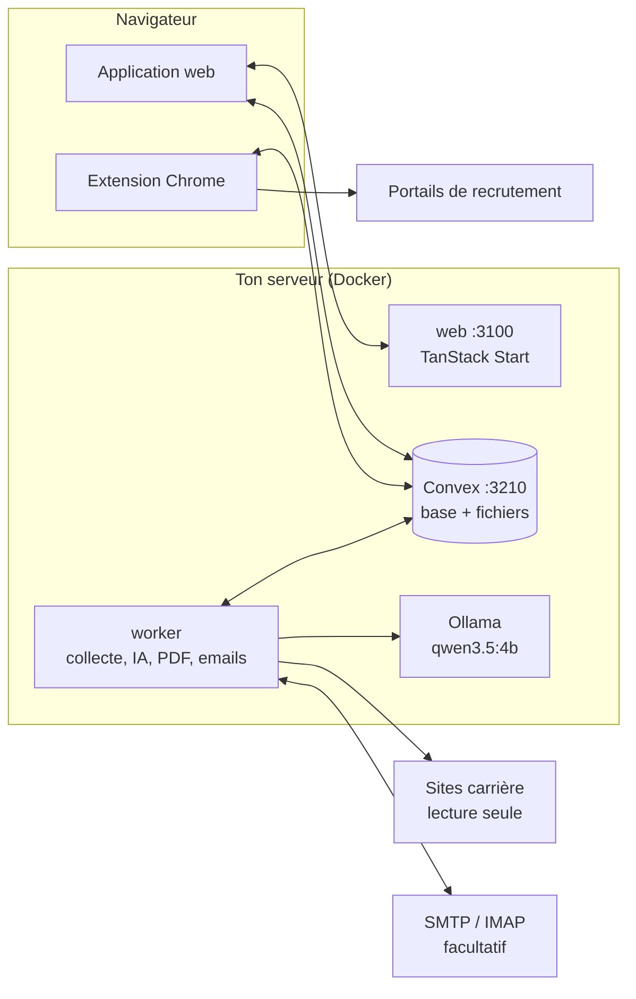

<div align="center">

# Market Radar

**Ta veille emploi et tes candidatures, sur ta propre machine.**

Market Radar surveille les sites carrière de 40 grandes entreprises, classe les offres selon ton profil,
prépare un CV et une lettre adaptés avec une IA locale, remplit les formulaires des portails de recrutement
et suit les réponses dans ta boîte mail. Rien ne sort de ton serveur. Rien n'est envoyé sans ton clic.

[Page de présentation](https://simonw31.github.io/market-radar/) · [Installer](#installer) · [Guide pour agent IA](READMELLM.md) · [Licence MIT](LICENSE)

</div>

---

## Ce que ça fait

| | |
|---|---|
| **Radar** | Collecte les offres de stage, d'alternance et de CDI sur 40 sites carrière (banques, conseil, industrie, tech). Chaque offre reçoit un score sur 100 et une priorité P1/P2/P3. Les offres publiées depuis moins de 24 h portent le tag « Vient de sortir ». |
| **Profils** | Plusieurs profils par installation (par exemple toi et ta colocataire) : contrats visés, mots-clés, expérience maximale, entreprises, poids du score. Chaque profil a son propre radar et son rapport. |
| **Rapports** | Un email quotidien ou hebdomadaire avec les nouvelles offres pertinentes. Facultatif. |
| **Candidatures** | Ton CV maître (importé depuis un PDF puis vérifié par toi) sert de base. Pour chaque offre, l'IA locale choisit les expériences et les compétences à mettre en avant et écrit une accroche. Le CV et la lettre sont assemblés à partir de gabarits et rendus en PDF avec Typst, en 70 à 90 secondes. |
| **Extension Chrome** | Sur Workday, Talentsoft, SmartRecruiters et en mode générique sur Taleo, SuccessFactors, TalentLink, iCIMS ou Avature : connexion, remplissage, CV et lettre joints. Elle s'arrête toujours avant le bouton « Envoyer ». |
| **Suivi** | Un tableau de toutes tes candidatures (envoyée, test, entretien, offre, refus) avec relances et export CSV. Un lecteur de boîte mail en lecture seule met les statuts à jour quand un recruteur répond. |
| **Barre des tâches** | Collectes, générations et envois en cours apparaissent en bas à droite avec leur progression. |

## Garde-fous

- **100 % local.** La base (Convex), l'IA (Ollama, modèle `qwen3.5:4b`) et le rendu des PDF tournent sur ta machine. Aucune clé d'API, aucun service payant.
- **Aucune candidature automatique.** Un email de candidature part seulement après validation et confirmation explicites, avec au plus 10 envois par 24 h. L'extension remplit, tu cliques « Envoyer ».
- **Mots de passe.** L'extension n'en stocke aucun : la connexion automatique utilise le gestionnaire de mots de passe de Chrome ou 1Password.
- **Boîte mail en lecture seule.** Rien n'est lu comme « lu », déplacé ou supprimé. Seuls les emails de recruteurs sont gardés (objet et extrait).
- **Pas de comptes utilisateurs.** L'application fait confiance à quiconque peut l'atteindre. Ne l'expose jamais telle quelle sur Internet (voir [Sur un VPS](#sur-un-vps)).

## Architecture



| Service | Rôle | Port |
|---|---|---|
| `web` | Interface (TanStack Start, React 19, shadcn/ui, Tailwind 4) | 3100 |
| `backend` | Convex auto-hébergé : base de données temps réel et stockage des PDF | 3210 |
| `dashboard` | Tableau d'administration Convex (clé admin requise) | 6791 |
| `worker` | Planificateur (cron), collecteurs, IA, rendu Typst, SMTP, IMAP | aucun |
| `ollama` | Modèle de langue local, accessible seulement depuis la machine | 11434 (127.0.0.1) |

## Installer

### Prérequis

| | Minimum | Confortable |
|---|---|---|
| Processeur | 4 cœurs x86_64 (arm64 prévu, pas encore testé) | 8 cœurs |
| Mémoire | 8 Go | 16 Go |
| Disque | 15 Go libres | 30 Go |
| Logiciels | Docker Engine 24+ avec Docker Compose v2, git | |

Testé sur un serveur Ubuntu à la maison (CasaOS, 12 cœurs, 16 Go). Tout VPS Linux avec Docker convient. Pas besoin de GPU : l'IA est plus lente sans, mais elle fonctionne.

### En une commande

```bash
git clone https://github.com/simonw31/market-radar.git
cd market-radar
./install.sh
```

Le script vérifie Docker, crée `.env` à partir de `env.example`, génère le secret Convex, télécharge le modèle (environ 3 Go), construit les images, déploie les fonctions et démarre tout. Il peut être relancé sans risque : il garde ta configuration, tes données et le modèle.

Sans question (pour un script ou un agent IA) :

```bash
./install.sh --host 192.168.1.10 --bind 0.0.0.0 --yes
```

| Option | Rôle | Défaut |
|---|---|---|
| `--host` | Adresse que ton navigateur utilise pour joindre la machine (IP locale, IP Tailscale, nom DNS) | détectée |
| `--bind` | Qui peut atteindre les ports : `0.0.0.0` (tout le réseau), `127.0.0.1` (la machine seule) ou une IP Tailscale | `0.0.0.0` |
| `--model` | Modèle Ollama | `qwen3.5:4b` |
| `--yes` | Ne pose aucune question | |

### Premiers pas

1. Ouvre `http://<ton-serveur>:3100` → onglet **Profils** : crée ton profil (contrats, mots-clés, email).
2. Dans **Candidature**, importe ton CV en PDF. L'IA locale le structure en 3 minutes environ, puis tu le relis et le valides.
3. Onglet **Collecte** → **Lancer une collecte**. Les offres arrivent dans **Radar**.
4. Sur une offre, **Préparer la candidature**, relis, valide, puis **Postuler sur le site**.

### Extension Chrome

1. `chrome://extensions` → active le **Mode développeur**.
2. **Charger l'extension non empaquetée** → choisis le dossier `extension/`.
3. Clique sur l'icône Market Radar → **Réglages** : adresse du serveur (`http://<ton-serveur>:3210`) et de l'application (`http://<ton-serveur>:3100`), puis **Enregistrer**. Chrome demande l'accès à ces deux adresses seulement.

### Sur un VPS

L'application n'a pas de comptes : quiconque atteint les ports voit tes CV et tes candidatures. Deux façons sûres de l'utiliser à distance :

**Tailscale (recommandé).** Installe [Tailscale](https://tailscale.com/download) sur le VPS et sur ton ordinateur, puis :

```bash
./install.sh --host "$(tailscale ip -4)" --bind "$(tailscale ip -4)" --yes
```

Les ports n'écoutent que sur le réseau privé Tailscale. Rien n'est ouvert sur Internet.

**Tunnel SSH.** Installe avec `--host localhost --bind 127.0.0.1`, puis depuis ton ordinateur :

```bash
ssh -N -L 3100:127.0.0.1:3100 -L 3210:127.0.0.1:3210 utilisateur@ton-vps
```

et ouvre `http://localhost:3100`.

Dans les deux cas, garde le pare-feu du VPS fermé sur 3100, 3210, 3211 et 6791.

### Emails (facultatif)

Dans `.env` :

- **Rapports** : `REPORT_EMAIL_ENABLED=true`, `SMTP_HOST`, `SMTP_USER`, `SMTP_PASS` (avec Gmail, un [mot de passe d'application](https://myaccount.google.com/apppasswords)), `REPORT_EMAIL_FROM`.
- **Suivi des réponses** : rien à ajouter avec Gmail, le lecteur IMAP réutilise le compte SMTP. Sinon `IMAP_HOST`, `IMAP_USER`, `IMAP_PASS`.
- **Candidatures par email** : l'adresse d'envoi doit être celle du profil qui postule, sinon l'envoi est refusé.

Puis `docker compose up -d worker`.

## Exploitation

| Action | Commande |
|---|---|
| Mettre à jour (code, fonctions, application) | `./ops/update.sh` |
| Sauvegarder toute la base, PDF compris | `./ops/backup.sh` → `backups/` |
| Voir les journaux | `docker compose logs -f worker` |
| État des services | `docker compose ps` |
| Clé admin du tableau Convex | `docker exec market-radar-convex /convex/generate_admin_key.sh` |

> `docker compose down -v` supprime la base et le modèle. Ne l'utilise que pour tout effacer.

`./ops/update.sh` refuse de redémarrer pendant une collecte ou une génération en cours (`--force` pour passer outre).

## Développer

```bash
npm install
npx convex dev            # ou un backend Convex auto-hébergé : voir CONVEX_SELF_HOSTED_URL
VITE_CONVEX_URL=http://localhost:3210 npm run dev
npm run worker            # collecte, IA et PDF (Ollama et Typst requis)
```

| Dossier | Contenu |
|---|---|
| `src/` | Interface : vues Radar, Candidatures, Suivi, Profils, Collecte, Workflow |
| `convex/` | Schéma, requêtes et mutations. `convex/lib/` : score, profils, lettre, calendrier, rapport |
| `scripts/` | Worker, collecteurs (`scrape-*.ts`), IA, rendu PDF, SMTP, IMAP |
| `templates/` | Gabarits Typst du CV et de la lettre |
| `extension/` | Extension Chrome (Manifest V3, JavaScript sans build) |
| `ops/` | Mise à jour et sauvegarde |

Ajouter une entreprise : un collecteur dans `scripts/scrape-<nom>.ts` (beaucoup réutilisent `scrape-workday.ts`, `scrape-smartrecruiters.ts` ou `scrape-successfactors.ts`), puis une entrée dans `convex/lib/sources.ts`.

Vérifications : `npx tsc --noEmit -p . && npx tsc --noEmit -p convex && npx biome check src`.

## Limites connues

- Les portails changent souvent : un adaptateur peut casser. Le bouton **Diagnostic** de l'extension copie la structure du formulaire (sans aucune valeur personnelle) pour corriger.
- L'interface et les textes générés sont en français.
- Les collecteurs lisent des pages publiques à un rythme modéré. Respecte les conditions d'utilisation des sites.

## Licence

[MIT](LICENSE)
